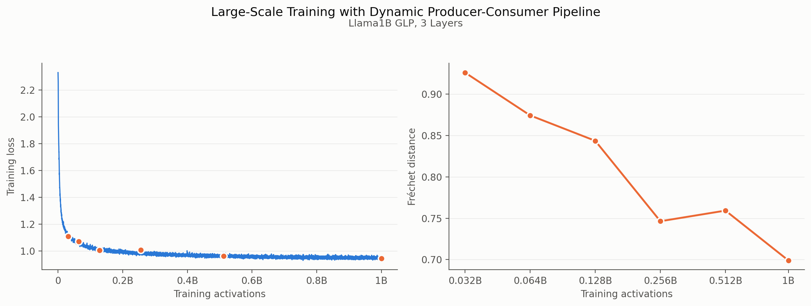

# Learning a Generative Meta-Model of LLM Activations
**Grace Luo, Jiahai Feng, Trevor Darrell, Alec Radford, Jacob Steinhardt**

This repository contains the PyTorch implementation of the paper "Learning a Generative Meta-Model of LLM Activations". The code walks through our proposed method for training an activation diffusion model, and using it for applications like on-manifold steering and scalar probing. We call this model a GLP, or Generative Latent Prior.

[[`Project Page`](https://generative-latent-prior.github.io)][[`arXiv`](https://arxiv.org/abs/2602.06964)]

## Compute
🌟 **TLDR:** Most of the scripts in this README take less than 24GB of VRAM, so they should fit on an Nvidia RTX 4090.

We want everyone to have a chance to try our models out, even in this economy. All of our released GLPs were trained on a billion [FineWeb](https://huggingface.co/datasets/HuggingFaceFW/fineweb) activations using two Nvidia A100 80GB GPUs (one for activation caching and the other for training), but with some ingenuity you can probably make it work on smaller GPUs too.

## Setup
This code was tested with Python 3.11. To set up the environment, please run:
```
conda env create -f environment.yaml
conda activate glp
pip install vllm==0.9.2 
pip install transformers==4.47.0
pip install -e .
```
You'll need to do the installation in the exact order above, and ignore any pip warnings. We used this exact setup, which was the only way we could get vllm/nnsight/transformers to work together.

## Pre-Trained Weights
You can view all the weights on [our HuggingFace page](https://huggingface.co/generative-latent-prior).

🌟 **TLDR:** For a quickstart, run
```
from glp.denoiser import load_glp
model = load_glp("generative-latent-prior/glp-llama8b-d6", device="cuda:0", checkpoint="final")
```

This grabs our main GLP trained on [Llama8B-Base](https://huggingface.co/meta-llama/Llama-3.1-8B) activations.
| Llama8B | Link |
|-|-|
| glp-llama8b-d6 | [Link](https://huggingface.co/generative-latent-prior/glp-llama8b-d6) |

If you're interested in diving deeper and studying scaling behavior, we also provide [Llama1B-Base](https://huggingface.co/meta-llama/Llama-3.2-1B) GLPs and all intermediate checkpoints.
| Llama1B | Link |
|-|-|
| glp-llama1b-d3 | [Link](https://huggingface.co/generative-latent-prior/glp-llama1b-d3) |
| glp-llama1b-d6 | [Link](https://huggingface.co/generative-latent-prior/glp-llama1b-d6)|
| glp-llama1b-d12 | [Link](https://huggingface.co/generative-latent-prior/glp-llama1b-d12)|
| glp-llama1b-d24 | [Link](https://huggingface.co/generative-latent-prior/glp-llama1b-d24) |
| glp-llama1b-d12-multi | [Link](https://huggingface.co/generative-latent-prior/glp-llama1b-d12-multi) |

Unless otherwise specified, GLPs are trained on the middlemost layer (Layer 15 for Llama8B, Layer 07 for Llama1B). We also provide a multi-layer GLP trained on all Layers 00-15 of Llama1B, called `glp-llama1b-d12-multi`. You can also directly transfer these GLPs, which were trained on Base models, onto Instruct models, as shown in the paper.

*Note:* Each intermediate checkpoint is labeled by "epoch," which corresponds to 1M activations. This means `epoch_1024` was trained on 1024M &asymp; 1B activations (and `final` is the same as `epoch_1024`). 
We use the term "epoch" loosely; in reality we stream data without repetition (so no activation is seen twice).

## Demo
🌟 **TLDR:** For a quickstart, walk through our demo notebook at `glp_demo.ipynb`.

In the demo, we'll walk through loading a GLP, generating activations, then using it for on-manifold steering.

## Applications
- **Scalar 1-D Probing:** Evaluate on the 113 binary classification datasets from [Kantamneni et. al., 2025](https://github.com/JoshEngels/SAE-Probes), by running `python3 glp/script_probe.py`.
- **On-Manifold Steering:** Post-process [Persona Vectors](https://github.com/safety-research/persona_vectors), SST-5 sentiment vectors, or [LlamaScope](https://huggingface.co/fnlp/Llama3_1-8B-Base-LXR-32x) SAE directions by following the instructions at `integrations/{persona_vectors,sentiment,sae}/README.md`.

*Note:* In the paper, we use the variable `t` to denote the timestep. In the codebase, we follow the [diffusers](https://github.com/huggingface/diffusers) scheduler convention and use `u = 1 - t` instead.

## Quickstart Training
🌟 **TLDR:** For a quickstart, train a toy Llama1B GLP in a few minutes.
```
# download data
huggingface-cli download generative-latent-prior/llama1b-layer07-fineweb-1M \
    --repo-type dataset  \
    --local-dir data/llama1b-layer07-fineweb-1M \
    --local-dir-use-symlinks False
# launch training
conda activate glp
python3 glp_train.py config=configs/train_llama1b_static.yaml
```

This trains on a small static sanity dataset with 1M activations,
representing the first 1M activations of the full dynamic dataset.
Even on this small dataset, you should see a beautiful loss curve that _just goes down_.
You can also download the [Llama8B sanity dataset](https://huggingface.co/datasets/generative-latent-prior/llama8b-layer15-fineweb-1M) and use `configs/train_llama8b_static.yaml`. Training on the full one billion activations takes 5.6 days for the Llama8B GLP.

## Large-Scale Training

For actual large-scale training, we recommend using the dynamic producer-consumer data pipeline. This pipeline requires two GPUs: one producer process saves activations, and one consumer process trains the GLP from those activations.

```
# GPU 0: activation producer
conda activate glp
CUDA_VISIBLE_DEVICES=0 python3 glp_save.py config=configs/save_llama1b_dynamic.yaml

# GPU 1: GLP trainer
CUDA_VISIBLE_DEVICES=1 python3 glp_train.py config=configs/train_llama1b_dynamic.yaml
```

For Llama8B, use `configs/save_llama8b_dynamic.yaml` and `configs/train_llama8b_dynamic.yaml`. For how the dynamic pipeline works (shard lifecycle, locking, and ejection),
see the module docstring in `glp_dataset.py`. For reference, the below figure shows the training loss and Fréchet distance curves from a full 1B-activation run of this pipeline:



### Multi-Layer Training

The same large-scale training pipeline also supports multi-layer training with an updated config. The multi-layer GLP additionally conditions on the layer position, which is encoded with a sinusoidal embedding and added to the timestep embedding.

```
# GPU 0: activation producer (all layers 00-15)
conda activate glp
CUDA_VISIBLE_DEVICES=0 python3 glp_save.py config=configs/save_llama1b_dynamic_multilayer.yaml

# GPU 1: GLP trainer
CUDA_VISIBLE_DEVICES=1 python3 glp_train.py config=configs/train_llama1b_dynamic_multilayer.yaml
```

When sampling from a multi-layer GLP, make sure to pass `layer_idx`:

```python
import torch
from glp import flow_matching
from glp.denoiser import load_glp

device = "cuda:0"
model = load_glp("generative-latent-prior/glp-llama1b-d12-multi", device=device)
noise = torch.randn(64, 1, model.denoiser.model.d_input, device=device)
# generate 64 Layer 07 activations of Llama1B
gen_latents = flow_matching.sample(model, noise, num_timesteps=100, layer_idx=7)
gen_acts = model.normalizer.denormalize(gen_latents, layer_idx=7)
```

## Meta-Neurons
We also release the meta-neurons of the Llama8B GLP, including their max activating examples and descriptions.
| Llama8B | Link |
|-|-|
| llama8b-layer15-meta-neurons | [Link](https://huggingface.co/datasets/generative-latent-prior/llama8b-layer15-meta-neurons) |

Download them with the following command:
```
huggingface-cli download generative-latent-prior/llama8b-layer15-meta-neurons \
    --repo-type dataset \
    --local-dir integrations/meta_neurons/runs/meta_neurons \
    --local-dir-use-symlinks False
```

To reproduce them yourself, follow the instructions at `integrations/meta_neurons/README.md`.

## Roadmap
All features marked as complete below are stable and ready to use.

**02-06-2026**
- [x] Release pre-trained GLP weights
- [x] Release training code at `glp_train.py`
- [x] Release Persona Vectors steering at `integrations/persona_vectors`
- [x] Release 1-D probing at `glp/script_probe.py`

**09-07-2026**
- [x] Release dynamic producer-consumer data pipeline at `glp_save.py`

**09-08-2026**
- [x] Release SAE and sentiment-based steering at `integrations/sae` and `integrations/sentiment`

**09-10-2026**
- [x] Release configs for multi-layer training

**09-12-2026**
- [x] Release delta LM computation code at `glp/script_delta_lm.py`
- [x] Release meta-neuron analysis code at `integrations/meta_neurons`

## Citing
```
@inproceedings{luo2026glp,
  title={Learning a Generative Meta-Model of LLM Activations},
  author={Grace Luo and Jiahai Feng and Trevor Darrell and Alec Radford and Jacob Steinhardt},
  booktitle={ICML},
  year={2026}
}
```